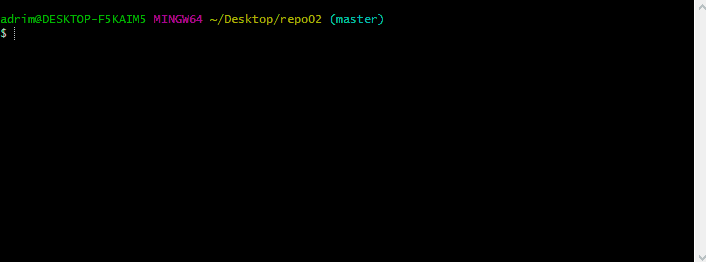

# Git cheat sheet  

## git init :hamster: 

  

  This comand is used to initialize a new local git repositry or reinitialize an existing one. Is the first command you have to do in order to start working with Git.  

:exclamation:Important:exclamation: 

- You have to be in the folder where the files you want to manage with Git are.

---
## git add :cherry_blossom:

This command adds new or changed files in your working directory to the Git staging area. This basically means that in order to manage wit git the files in your repository you need to add them

- You can add all the files wit git add ., or add one or more with git add x, where x is the file name with the extension 

## git status :bell: