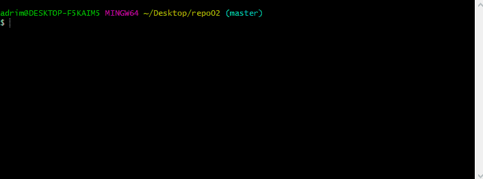
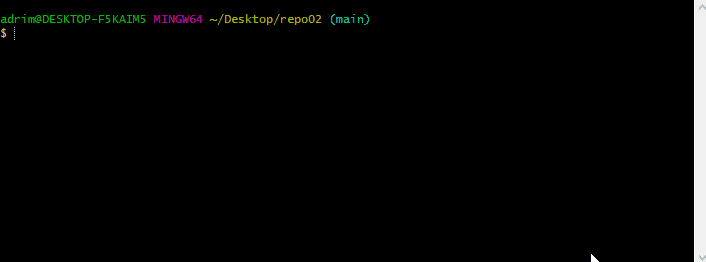
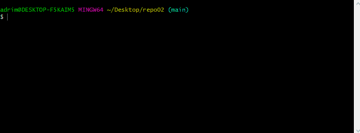

# Git cheat sheet  

## git init :hamster: 

  

  This comand is used to initialize a new local git repositry or reinitialize an existing one. Is the first command you have to do in order to start working with Git.  

:exclamation:Important:exclamation: 

- You have to be in the folder where the files you want to manage with Git are.

---
## git add :cherry_blossom:

This command adds new or changed files in your working directory to the Git staging area. This basically means that in order to manage wit git the files in your repository you need to add them.

- You can add all the files with **git add .** or add one or more with **git add x**, where x is the file name with the extension.

---

## git status :bell:

It's a command used to display the state of the repository and staging area.

- In this case it shows that the file has changes that need to be commited.
---

## git commit :camera:

With this command yo make an snapshot of your repo at a specific point in time. Is like a "save" freature that allows you to save all the work in the repository until now.

- If you add **-m** at the end of the command, it allows you to write a comment where you can write what are the changes made.
---

## git remote add and git push :wolf:

 

With **git remote add origin url** where url is the url of your remote repository, you associate the local and remote repositories.

With **git push -u origin main** you are sending all the files with commits to the remote repository, in this case to the main branch.

  - To rename your branch to main, you have to write **git branch -M main** in Git Bash.