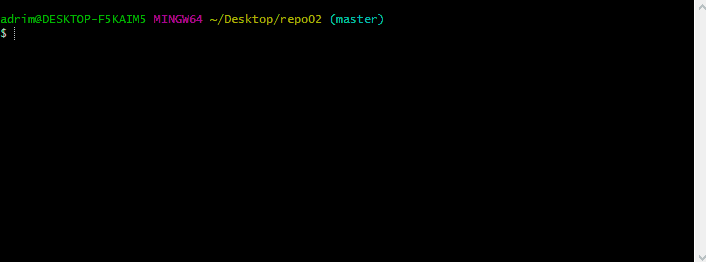

# Git cheat sheet  

## Git init  

  

  This comand is used to initialize a new local git repositry or reinitialize an existing one. Is the first command you have to do in order to start working with Git. 
   
   

:exclamation:Important:exclamation:

You have to be in the folder where the files you want to manage with Git are.

---
## Git add

